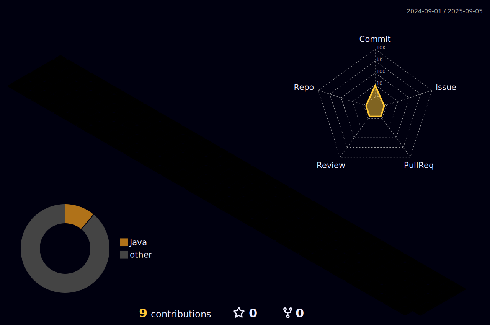

|  |  |  
 |-----------------------------------------------------------------------------------------------------------------------------------------------------------------------------------------------------------------|----------------------------------------------------------------------------------------------------------------------------------------------------------------------------------------------------|

  

   

  

##
   

     
  

  
 

 
  
  

  

